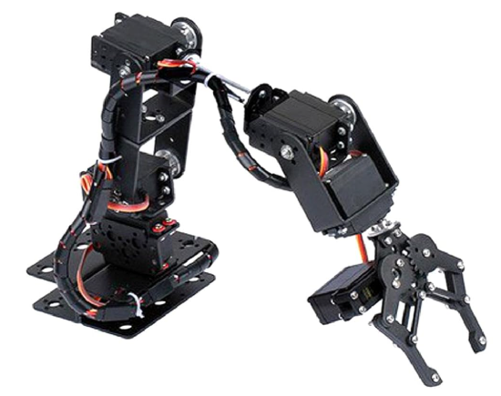

# ROS 2 Simple 6‑DOF Arm – Architecture Overview

This repository provides a **minimal, educational ROS 2 Humble setup** for a **6‑DOF servo‑based robotic arm**, supporting:

- Visualization in **RViz2**
- **Physical simulation in Gazebo Sim (new Gazebo)** using `ros2_control` + `gz_ros2_control`
- **Real‑hardware control** via USB serial (ESP32/Arduino → PWM servos)

The design goal is **clarity and pedagogy**: each package has a single responsibility, and the student can clearly see how description, simulation, and real control are separated.

**Webgraphy:**
- [Real robotic arm](https://www.amazon.es/gp/product/B0B134Q4SN)



---

## High‑level Architecture

```
           +-------------------+
           | my_arm_description|
           |  (URDF / Xacro)   |
           +---------+---------+
                     |
          robot_description (URDF)
                     |
     +---------------+----------------+
     |                                |
+----v----+                     +-----v-----+
| Gazebo  |                     | Real robot|
| Sim     |                     | (ESP32)   |
| (physics|                     | PWM servos|
+----+----+                     +-----+-----+
     |                                ^
     | ros2_control                   | USB serial
     v                                |
/controller_manager           my_arm_control
(joint controllers)           (serial bridge)
```

---

## Package Overview

### 1. `my_arm_description`

**Robot model and visualization (no control logic)**

This package defines **what the robot is**, not how it is controlled.

**Purpose**

- Define the kinematic structure of the 6‑DOF arm
- Provide a parametric model reusable for RViz and Gazebo
- Centralize all geometric and joint‑related definitions

**Main contents**

- `urdf/my_arm.urdf.xacro`

  - Parametric Xacro model of the arm
  - Defines:
    - Links and joints (6 revolute joints + fixed tool frame)
    - Link lengths as parameters
    - Joint limits and axes
    - `ros2_control` interfaces (for simulation)
    - Gazebo Sim plugin (`gz_ros2_control`)

- `launch/display.launch.py`

  - Launches:
    - `robot_state_publisher`
    - `joint_state_publisher_gui` (for testing without hardware)
    - `rviz2`

- `rviz/my_arm.rviz`

  - Preconfigured RViz view:
    - Fixed frame: `base_link`
    - RobotModel + TF enabled

**Key idea for students**

> This package contains *only* the robot description. It is reused unchanged for simulation and real hardware.

---

### 2. `my_arm_gz`

**Gazebo Sim physical simulation (no real hardware)**

This package defines **how the robot behaves in simulation**.

**Purpose**

- Run a physics‑based simulation in **Gazebo Sim (new Gazebo)**
- Connect Gazebo joints to ROS 2 using `ros2_control`
- Provide joint controllers equivalent to real hardware

**Main contents**

- `worlds/empty.sdf`

  - Minimal Gazebo Sim world (ground + sun)

- `config/gz_controllers.yaml`

  - `ros2_control` configuration for simulation
  - Defines:
    - `joint_state_broadcaster`
    - `joint_trajectory_controller` for the 6 joints

- `launch/gz_sim.launch.py`

  - Starts Gazebo Sim
  - Spawns the robot from `robot_description`
  - Loads `gz_ros2_control`
  - Spawns controllers via `controller_manager`
  - Launches RViz for visualization

**Key idea for students**

> Gazebo Sim + `ros2_control` makes the simulated robot behave like a real one from ROS’s point of view.

---

### 3. `my_arm_control`

**Real hardware interface (ESP32 / Arduino via USB serial)**

This package defines **how ROS talks to the real arm**.

**Purpose**

- Convert ROS joint commands into serial messages
- Send desired joint angles to an ESP32/Arduino
- Publish estimated joint states for TF and visualization

**Main contents**

- `my_arm_control/serial_bridge.py`

  - Subscribes to `/joint_commands` (`sensor_msgs/JointState`)
  - Converts joint angles to a simple ASCII protocol
  - Sends commands over `/dev/ttyUSB*` to the ESP32

- `my_arm_control/joint_state_estimator.py`

  - Publishes `/joint_states`
  - Uses the last commanded angles as an estimated state
  - Enables TF and RViz visualization without encoders

- `config/arm_params.yaml`

  - Hardware configuration:
    - Serial port and baud rate
    - Joint names and order
    - Publish/update rates

- `launch/real.launch.py`

  - Launches:
    - `robot_state_publisher`
    - `serial_bridge`
    - `joint_state_estimator`

**Key idea for students**

> This package is *not used in simulation*. It is only for the real robot.

---

## Simulation vs Real Execution

| Aspect        | Simulation (Gazebo Sim) | Real Robot               |
| ------------- | ----------------------- | ------------------------ |
| Physics       | Yes                     | No (handled by hardware) |
| ros2\_control | `gz_ros2_control`       | Not used                 |
| Joint states  | From Gazebo physics     | Estimated from commands  |
| Package used  | `my_arm_gz`             | `my_arm_control`         |

---

## Repository setup

Clone your project:
````shel
cd /root/
git clone https://github.com/manelpuig/ROS2_my_robot_arm_ws.git
cd ROS2_my_robot_arm_ws
colcon build --symlink-install --merge-install
source install/setup.bash
````
Add these lines in `.bashrc`:
````shell
source /usr/share/colcon_argcomplete/hook/colcon-argcomplete.bash
source /root/ROS2_my_robot_arm_ws/install/setup.bash
cd /root/ROS2_my_robot_arm_ws
````


