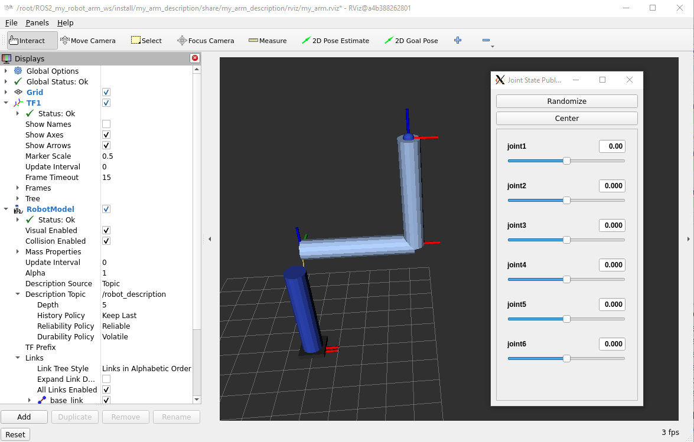
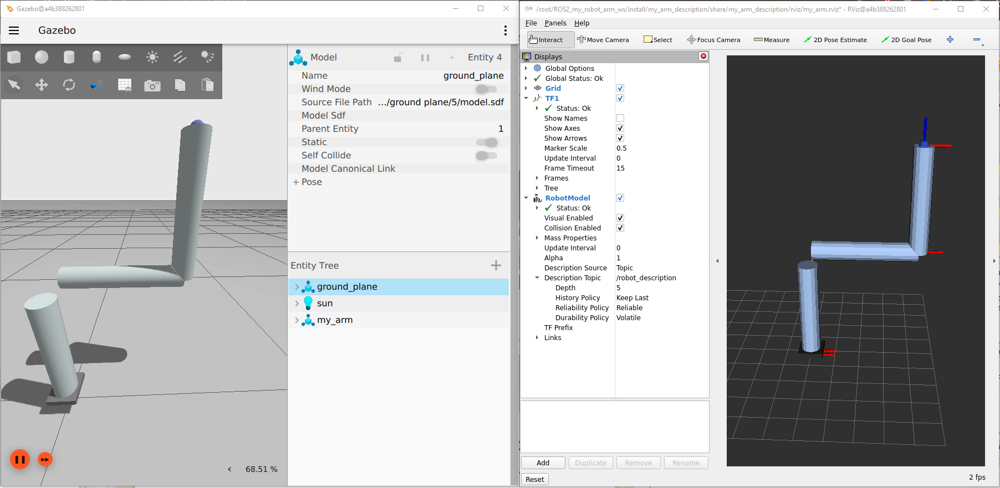
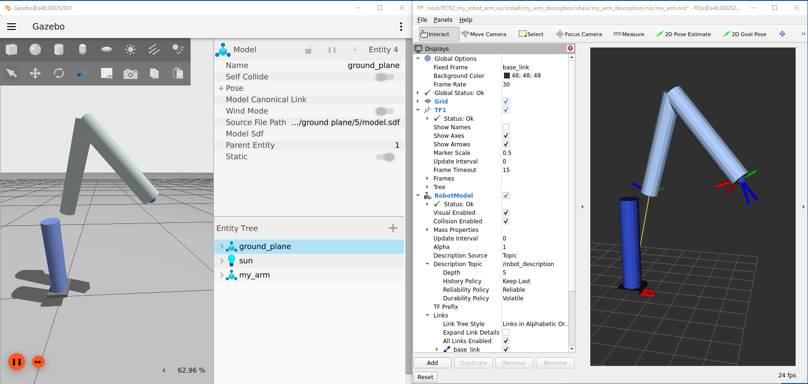

# Robot model

Once you have created different robot-arm models:
- generic 6DoF robot-arm
- PUMA robot-arm
- UR5e robot-arm

We can see the different models in RVIZ2 tool:
- generic 6DoF robot-arm:
````shell
ros2 launch my_arm_description display.launch.py use_sim_time:=false model:=my_arm.urdf.xacro
````

- PUMA robot-arm:
````shell
ros2 launch my_arm_description display.launch.py use_sim_time:=false model:=my_arm_puma.urdf.xacro
````

- UR5e robot-arm:
````shell
ros2 launch my_arm_description display.launch.py use_sim_time:=false model:=my_arm_ur5e.urdf.xacro
````


- Bringup the robot arm in Gazebo sim:
````shell
ros2 launch my_arm_gz gz_sim.launch.py use_sim_time:=true model:=my_arm_puma.urdf.xacro
````



- Enviar joint-trajectory
````shell
ros2 launch my_arm_control send_joint_trajectory.launch.py use_sim_time:=true model:=my_arm_puma.urdf.xacro
````

# Move to pose

This node receives a desired **tool pose** (position + orientation) expressed in the **base frame** and computes a 6-joint configuration using **numerical inverse kinematics (IK)**.

## What it does
- Computes `q` such that `FK(q) ≈ T_des` (target pose).
- Uses a **numerical Jacobian** (finite differences) and a **Damped Least Squares** step to update the joints iteratively.
- Once IK converges (or reaches the iteration limit), it sends a `FollowJointTrajectory` goal to the controller:
  `/arm_controller/follow_joint_trajectory`.

- Launch the simulation environment
````shell
ros2 launch my_arm_gz gz_sim.launch.py use_sim_time:=true model:=my_arm_puma.urdf.xacro
````
- Launch the `send_pose_trajectory` node:
````shell
ros2 launch my_arm_control send_pose_trajectory.launch.py use_sim_time:=true robot_model:=puma
````

