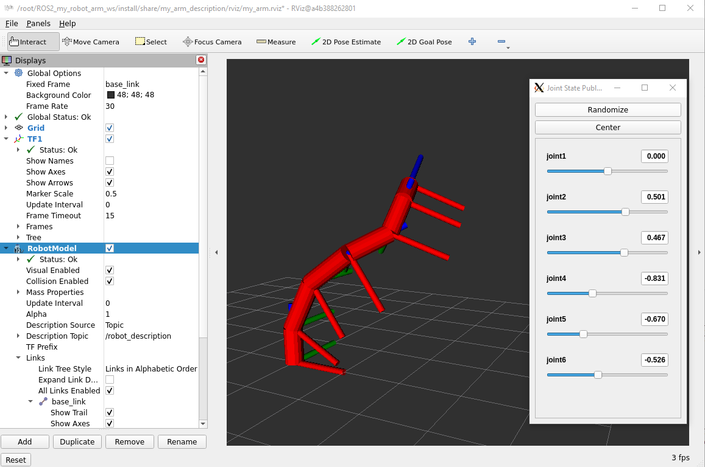
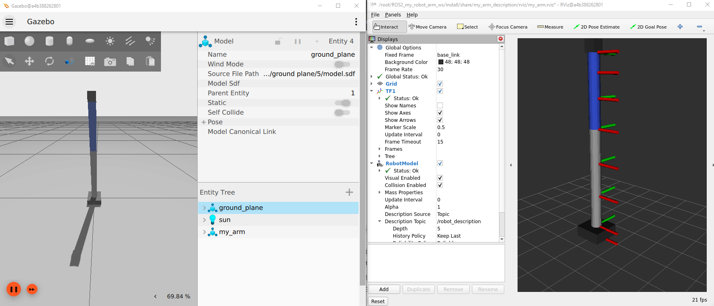

# Robot model

Once you have created a model you can:
- Review the arm model on RVIZ2:
````shell
ros2 launch my_arm_description display.launch.py use_sim_time:=true arm:=my_arm_puma.urdf.xacro
````


- Bringup the robot arm in Gazebo sim:
````shell
ros2 launch my_arm_gz gz_sim.launch.py use_sim_time:=true
````


- Enviar joint-trajectory
````shell
ros2 launch my_arm_control send_joint_trajectory.launch.py use_sim_time:=true
````

# Move to pose

This node receives a desired **tool pose** (position + orientation) expressed in the **base frame** and computes a 6-joint configuration using **numerical inverse kinematics (IK)**.

## What it does
- Computes `q` such that `FK(q) ≈ T_des` (target pose).
- Uses a **numerical Jacobian** (finite differences) and a **Damped Least Squares** step to update the joints iteratively.
- Once IK converges (or reaches the iteration limit), it sends a `FollowJointTrajectory` goal to the controller:
  `/arm_controller/follow_joint_trajectory`.

- Launch the simulation environment
````shell
ros2 launch my_arm_gz gz_sim.launch.py
````
- Launch the `move_tool_to_pose` node:
````shell
ros2 launch my_arm_control move_tool_to_pose.launch.py use_sim_time:=true
````
